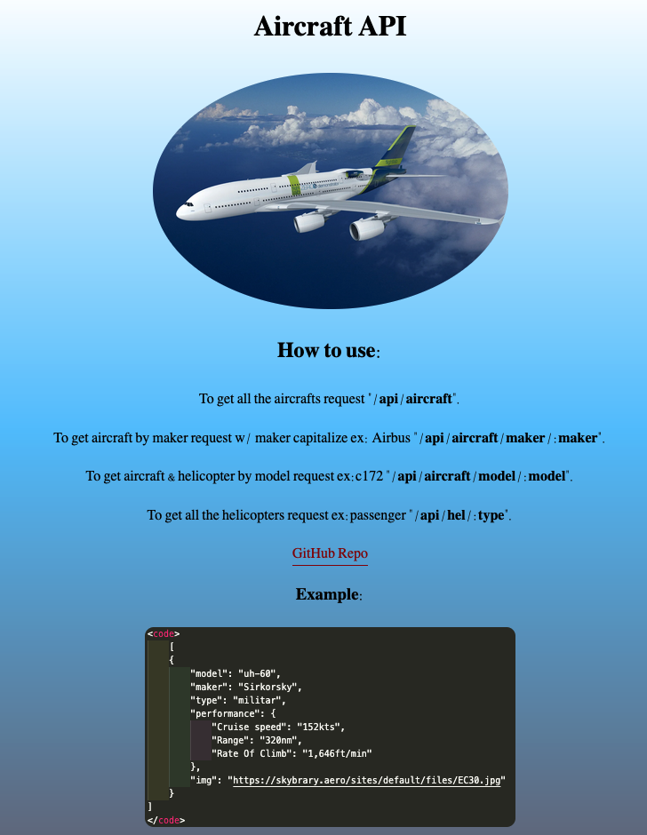

# Aircraft API

- I've been working in aviation field for 9 years and my love for aircrafts has led me to this api.

- [live site]()

## Tech

- HTML
- CSS
- Node
- Express

# Take away

- this has take me out of my confort zone because I've been working mostly in front end and now working on the backend I feel that is a new world.

- Improving my performance with node and express, getting better with sintax and the use of npm.

- This is not an hard task but a task that you need to be focused and to practice a lot.
